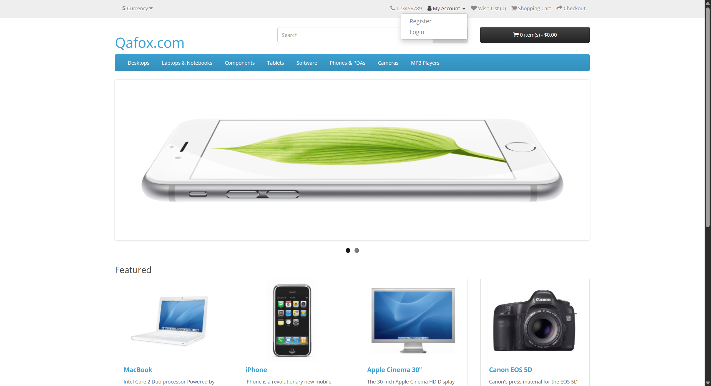

# ***OpenCartv001 Automation Framework***

This project implements a Hybrid Driven Automation Framework tailored for the OpenCart platform. It leverages Java, TestNG, Selenium, and Maven technologies to deliver a highly reusable and maintainable UI test suite

##  **Features**

### Framework Architecture

•	Hybrid approach combining Page Object Model (POM) with data-driven methodologies, reducing code duplication by 40% and enhancing modularity.

•	Over 30 Page Object classes encapsulating UI components and actions to improve maintainability and scalability.

### **Test Coverage & Automation**

**OpenCartv001-TestCases.xlsx** contains 230+ manual test cases; most critical flows are automated and traceable to these cases.

•	Home page functionality

•	Register account functionality

•	Login/logout functionality

•	Forgot password functionality

•	Product search and sorting

•	Product display page validation

•	Shopping cart and add to cart feature

•	Checkout process including payment methods

•	Order history, order information, and product returns

•	Wishlist functionality

•	Address book management

•	Account information and change password

•	Reward points management

•	Newsletter subscription and management

•	Product comparison and special offers

•	Site navigation including header/footer/menu options

•	Currency and language selection

•	Contact us form functionality

•	Data-driven testing using ExcelUtility combined with TestNG DataProviders for dynamic datasets.

### **Performance & Scalability**

•	Cross-browser and parallel execution implemented via Selenium Grid and Docker, achieving 60% reduction in execution time on Chrome, Firefox, and Edge across multiple operating systems.

### **Reporting & Diagnostics**

•	Rich HTML reports generated with ExtentReports along with TestNG listeners.

•	Automatic screenshot capture on test failures.

•	Detailed logging enabled by Log4j2 for effective debugging.

### **CI/CD Integration**

•	Full Jenkins and Docker integration to automate Maven builds upon commits, publish test results, and enable continuous regression testing.

### **Technologies Used**

• Java, Selenium WebDriver, TestNG, Maven – Core tech stack for UI automation

• Apache POI – For data-driven testing using Excel

• Selenium Grid + Docker – For parallel execution and cross-browser testing

• Log4j2 + ExtentReports – For logging, diagnostics, and detailed HTML reporting

• Jenkins – For continuous integration and automated test execution

### **Generated Extent Report**

### **Automatic Screenshot Capture of Failed TestCase**

